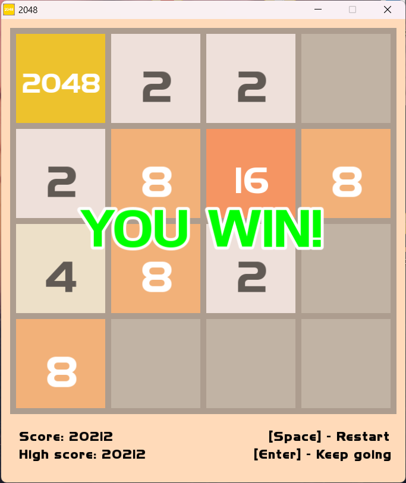
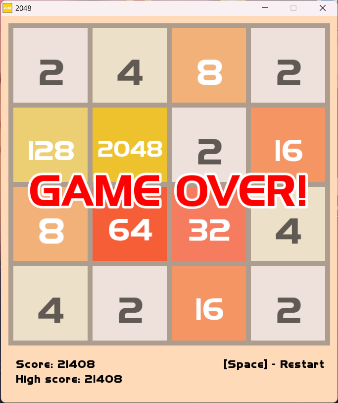

<h1>2048 Game</h1>

<table align="center">
  <tr>
    <td></td>
    <td></td>
  </tr>
</table>

This is my implementation of 2048 (<a href="http://gabrielecirulli.github.io/2048/">Click to play original</a>), 
that was made in C++ using SFML library

<h2>How to build and run</h2>

First you need C++17 compliant compiler and CMake build system

<ul>
    <li>
        Clone this repository to your PC:
        <blockquote>
            <code>git clone https://github.com/k-o-white/2048_SFML.git</code></blockquote>
        and then go to folder
        <blockquote>
            <code>cd 2048_SFML</code>
        </blockquote>
    </li>
    <li>
        Create folder for building app and go to it:
        <blockquote>
            <code>mkdir build</code> 
            <code>cd build</code>
        </blockquote>
    </li>
    <li>
        Input commands:
        <blockquote>
            <code>cmake -G "MinGW Makefiles" ..</code> 
            <code>mingw32-make</code>
        </blockquote>
    </li>
    <li>
        Run 2048_SFML.exe:
        <blockquote>
            <code>start 2048_SFML.exe</code>
        </blockquote>
    </li>
</ul>

<h2>Control</h2>
<ul>
    <li>Arrow keys or WASD - moving tiles</li>
    <li>Space - restart</li>
    <li>Y - continue/restart, if you achieved 2048/lost</li>
    <li>N - quit game, if you achieved 2048 or lost</li>
</ul>

